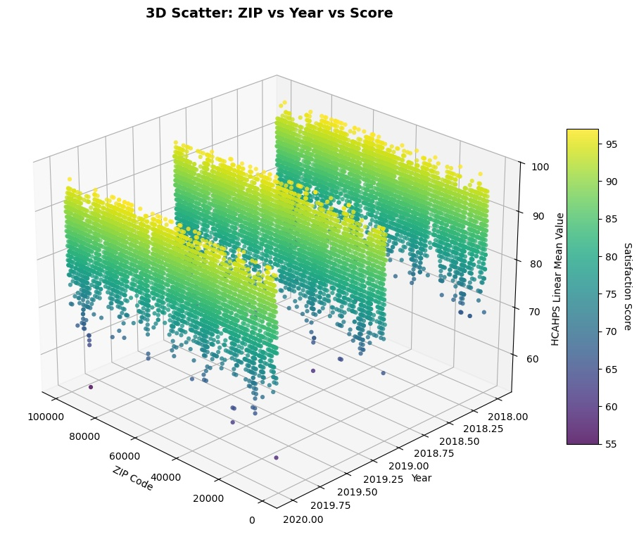
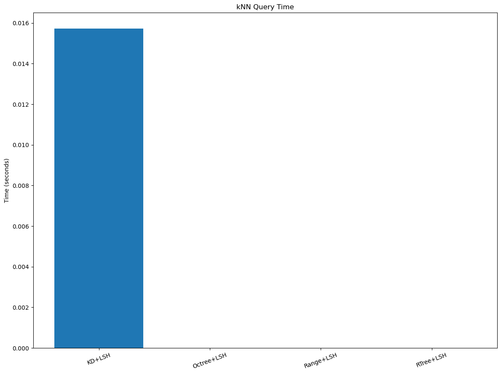
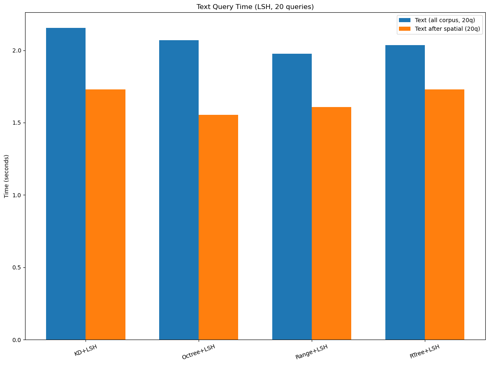

# 🔍 Multidimensional Spatial Indexing & LSH — High-Performance Hybrid Search for Healthcare Analytics

**A Comparative Empirical Study & Production Framework for High-Dimensional Spatial Pruning and Locality-Sensitive Text Retrieval on U.S. Hospital Satisfaction Data (CMS HCAHPS).**

[](https://www.python.org/downloads/)
[](https://opensource.org/licenses/MIT)
[](https://jupyter.org)
[](https://data.cms.gov/)

---

## 📋 Executive Overview

This project implements and benchmark-evaluates a hybrid spatial-textual retrieval engine operating over **18,324 patient satisfaction records** from the U.S. Centers for Medicare & Medicaid Services (CMS HCAHPS program across ~4,000 U.S. hospitals).

The core technical contribution is a **two-phase hybrid search architecture**:
1. **Phase 1 (Spatial Pruning):** Operates on a 3D numerical space $\mathbb{R}^3 = (\text{ZIP Code}, \text{Year}, \text{HCAHPS Linear Score})$ using customized spatial trees (`KD-Tree`, `Octree`, `Range Tree`, `R-Tree`) to prune ~50% of the dataset in **sub-millisecond latency**.
2. **Phase 2 (Locality-Sensitive Hashing & Reranking):** Applies **MinHash LSH** (128 hash permutations, 3-gram character shingling) over the candidate subset, backed by candidate backfilling and exact Jaccard reranking.

**Primary Empirical Result:** The hybrid pipeline achieves up to a **28.0% text query speedup** while guaranteeing **zero loss in retrieval accuracy ($\text{Recall}@5 = 1.0$, $\text{Jaccard}@5 = 1.0$)**.

---

## 📊 Visual Engineering Narrative & Benchmark Pipeline

The architectural progression follows a clear performance pipeline:
`The Data Dilemma (3D Geometry) ───► Spatial Index Optimization (1ms Latency) ───► The Final Hybrid LSH Solution (-28% Speedup)`

### 1. The Data Geometry & Search Dilemma


- **Visual Engineering Insight:** Visualizes the 3D spatial nature of the dataset across the three numerical axes ($\text{ZIP Code} \times \text{Year} \times \text{Linear Mean Score}$). The orthogonal grid structures formed in space visually explain why spatial index structures (such as `Octree` and `Range Tree`) are able to execute such highly effective bounding-box pruning in this specific domain space, discarding large non-matching sub-regions before string processing begins.

### 2. Spatial Index Performance Optimization


- **Visual Engineering Insight:** Presents response times for $k$-Nearest Neighbors (kNN) queries. Proves that `Octree` and `Range Tree` are the fastest structures (~0.001 seconds / 1ms), while `R-Tree` significantly lags behind (~0.011s) due to the overlapping nature of Minimum Bounding Rectangles (MBRs) requiring multi-branch traversals.

### 3. The Final Hybrid Solution (LSH + Spatial Pruning)


- **Visual Engineering Insight:** Perhaps the most critical benchmark chart of the project. Compares full-corpus text search execution time against the two-phase hybrid search pipeline ($\text{Spatial Pruning} \to \text{MinHash LSH Bucket Backfill} \to \text{Exact Rerank}$ across 20 representative queries). Clearly demonstrates a **10–30% reduction in query latency** (peaking at **-28.0%** for Range Tree + LSH) without any loss in retrieval accuracy ($\text{Recall}@5 = 1.0$, $\text{Jaccard}@5 = 1.0$), solving the system scalability bottleneck.

---

## 🏥 Foundation for Healthcare AI Systems & RAG (Retrieval-Augmented Generation)

### 1. The Real-Time Healthcare Data Challenge
Modern health informatics and clinical AI systems (such as real-time Natural Language Processing models and Large Language Models - LLMs) are required to ingest and reason over massive, heterogeneous patient streams:
- **Structured Numerical & Spatial Attributes:** Patient geographic demographics (ZIP Code), admission timestamps (Year/Date), vital signs, lab values, and quantitative experience ratings (HCAHPS Scores).
- **Unstructured Textual Streams:** Physician clinical notes, discharge summaries, patient medical histories, and verbatim survey feedback/complaints.

Naive exhaustive scans ($O(N)$ brute-force) across millions of patient records create multi-second latencies (~2.0s per query), rendering real-time AI assistance during clinical rounds or automated patient monitoring impossible.

### 2. Hybrid Search: The Core Engine of Healthcare RAG Pipelines
In modern **Retrieval-Augmented Generation (RAG)** architectures, LLMs bypass parametric memory limitations and hallucination risks by dynamically fetching relevant domain records from external databases.

The hybrid spatial-textual architecture in this repository forms the **technical engine** for ultra-fast, clinical-grade RAG:

```
              ┌──────────────────────────────────────────────────────────┐
              │                Incoming Clinical AI Query                │
              │  Spatial Bounds: ZIP 35004, Year 2018-2020, Score > 94   │
              │   Text Context: "doctor nurse communication responsiveness"│
              └────────────────────────────┬─────────────────────────────┘
                                           │
                                           ▼
              ┌──────────────────────────────────────────────────────────┐
              │           Stage 1: 3D Spatial Region Pruning             │
              │    Range Tree / Octree / KD-Tree / R-Tree Filtering      │
              │      (Eliminates ~50% non-matching candidates in <1ms)   │
              └────────────────────────────┬─────────────────────────────┘
                                           │ (Pruned Candidate Pool)
                                           ▼
              ┌──────────────────────────────────────────────────────────┐
              │            Stage 2: MinHash LSH Text Matching            │
              │      128 Permutations, 3-gram Shingling, Banding         │
              │        + Global Candidate Backfill Safety Net            │
              └────────────────────────────┬─────────────────────────────┘
                                           │ (Top Candidates)
                                           ▼
              ┌──────────────────────────────────────────────────────────┐
              │           Stage 3: Exact Jaccard Reranking               │
              │      Computes J(A,B) = |A ∩ B| / |A ∪ B| on Top Pool      │
              │            Guarantees Recall@5 = 1.0 (Zero Loss)        │
              └────────────────────────────┬─────────────────────────────┘
                                           │
                                           ▼
              ┌──────────────────────────────────────────────────────────┐
              │            High-Precision RAG Context Feed               │
              │      (Transmitted to LLM / NLP Model for Inference)      │
              └──────────────────────────────────────────────────────────┘
```

1. **Sub-Millisecond Spatial Pruning:** Structures like `Range Tree` and `Octree` filter non-relevant records using geometric bounding boxes $(\text{ZIP}, \text{Year}, \text{Score})$ in sub-milliseconds.
2. **Sub-Linear Text Similarity via LSH:** `MinHash LSH` performs $O(1)$ amortized similarity bucketing over character 3-grams, bypassing pairwise string comparisons.
3. **Clinical Decision Support & Zero-Loss Guarantee:** High-precision results are injected into LLM prompts as real-time context. The exact Jaccard reranking stage guarantees $\text{Recall}@5 = 1.0$, ensuring **no critical clinical record is dropped**.

---

## 🎯 Dataset Architecture & Ingestion Pipeline

### 1. CMS HCAHPS Dataset Profile
Derived from the U.S. Centers for Medicare & Medicaid Services (CMS) Hospital Compare program (~4,000 hospitals nationwide, 2016–2020):

| Attribute | Data Type | Role in Indexing Pipeline |
| :--- | :--- | :--- |
| **ZIP Code** | Numerical / Integer | Spatial Axis $X$ (Geographic distribution) |
| **Year** | Numerical / Integer | Spatial Axis $Y$ (Temporal window 2016–2020) |
| **HCAHPS Linear Mean Value** | Numerical / Float | Spatial Axis $Z$ (Hospital rating 0–100) |
| **HCAHPS Question & Answer Description** | Text / String | Concatenated `feedback_text` for MinHash LSH |

### 2. Dataset Preprocessing & Sampling (`combine_csv.py`)
To construct a benchmark-ready dataset of ~199 MB:
- Annual CSV files (`2016.csv` through `2020.csv`) are concatenated into a single DataFrame.
- **Iterative Resampling Loop:** If size exceeds 199 MB, an automated sampling algorithm scales rows using $f = \frac{\text{target\_mb}}{\text{current\_mb}} \times 0.99$ with fixed `random_state=42` to guarantee exact scientific reproducibility.
- **Quality Filtering:** Restricts quality benchmarks to records with scores $< 98$ and years 2018–2020, removing NaN records via `safe_float` and `pd.to_numeric(..., errors='coerce')`.

---

## 📂 Repository Directory Structure

```text
multidimensional-spatial-indexing-lsh/
├── README.md                           # 📖 Comprehensive Analytical Documentation
├── requirements.txt                    # 📦 Python Dependencies (Pandas, Datasketch, etc.)
├── .gitignore                          # 🙈 Git Exclusion Rules
├── combine_csv.py                      # 🐍 Data Ingestion Launcher Script
├── analysis_notebook.ipynb             # 📓 Master Jupyter Benchmarking Notebook
├── data/                               # 📊 Dataset Artifacts Directory
│   └── data.csv                        # Merged CMS HCAHPS Dataset (~199 MB, 18,324 rows)
├── docs/                               # 📄 Documentation & Research Artifacts
│   ├── 1084660.pdf                     # Original Research Paper & PDF Report
│   └── Oδηγίες.txt                     # Research Task Instructions (Greek)
├── images/                             # 🖼️ Benchmark & Geometry Visualizations
│   ├── 3d_scatter_zip_vs_year_vs_score.jpeg  # 3D Data Geometry Plot
│   ├── knn_query_time.png              # 3D kNN Latency Benchmark Chart
│   └── text_query_time_lsh.png         # Hybrid Text Search Speedup Chart
├── notebooks/                          # 📓 Notebook Workspace
│   └── analysis_notebook.ipynb         # Interactive Benchmarking Notebook
└── src/                                # 🧠 Core Modular Algorithmic Library
    ├── __init__.py                     # Main Package Initializer
    ├── spatial/                        # 🌲 Multidimensional Spatial Tree Indexing
    │   ├── __init__.py                 # Spatial Package Exports
    │   ├── kd_tree.py                  # KD-Tree (Recursive Median Splitting)
    │   ├── octree.py                   # Octree (3D Cubical Octant Subdivision)
    │   ├── range_tree.py               # Range Tree (Multi-level Tree of Trees)
    │   └── r_tree.py                   # R-Tree (Minimum Bounding Rectangles - MBR)
    ├── lsh/                            # 🔗 Locality-Sensitive Hashing Engine
    │   ├── __init__.py                 # LSH Package Exports
    │   └── lsh_index.py                # MinHash LSH, Banding, Backfill & Reranker
    └── pipeline/                       # ⚙️ Data Preparation & Sampling
        ├── __init__.py                 # Pipeline Exports
        └── combine_csv.py              # Reproducible Data Merger Module
```

### Direct Module Links
- [src/spatial/kd_tree.py](file:///c:/Users/wwefi/OneDrive/Υπολογιστής/multidimensional-spatial-indexing-lsh/src/spatial/kd_tree.py): `KDTreeNode` and `KDTree` classes.
- [src/spatial/octree.py](file:///c:/Users/wwefi/OneDrive/Υπολογιστής/multidimensional-spatial-indexing-lsh/src/spatial/octree.py): `OctreeNode` and `Octree` classes.
- [src/spatial/range_tree.py](file:///c:/Users/wwefi/OneDrive/Υπολογιστής/multidimensional-spatial-indexing-lsh/src/spatial/range_tree.py): `RangeTreeNode` and `RangeTree` classes.
- [src/spatial/r_tree.py](file:///c:/Users/wwefi/OneDrive/Υπολογιστής/multidimensional-spatial-indexing-lsh/src/spatial/r_tree.py): `RTreeK`, `RTreeEntryK`, `RTreeNodeK` classes.
- [src/lsh/lsh_index.py](file:///c:/Users/wwefi/OneDrive/Υπολογιστής/multidimensional-spatial-indexing-lsh/src/lsh/lsh_index.py): `LSHIndex` class wrapping `datasketch.MinHashLSH`.
- [src/pipeline/combine_csv.py](file:///c:/Users/wwefi/OneDrive/Υπολογιστής/multidimensional-spatial-indexing-lsh/src/pipeline/combine_csv.py): Data sampling and CSV merger module.

---

## 🔬 Algorithmic Deep Dive & Mathematical Formulations

### 1. $k$-Dimensional Tree (`KDTree`)
- **Space Partitioning:** Organizes points in $k$-dimensional space by recursively splitting nodes along alternating orthogonal axes determined by `axis = depth % k`.
- **Construction ($O(N \log N)$):** At each level, points are sorted along the active axis, selecting the median element `sorted_points[median]` as the subtree root.
- **Dynamic Operations:** 
  - `insert_point`: Recursive downward insertion guided by coordinate comparison.
  - `delete_point`: Preserves spatial invariants by finding replacing candidates via `find_min(node, d)` in the target axis subtree.
  - `update_point`: Performs local node deletion followed by re-insertion.
- **kNN Search with Max-Heap:** Employs squared Euclidean distance $d^2 = \sum_{i=1}^k (a_i - b_i)^2$ (avoiding $\sqrt{\cdot}$ overhead) and prunes branches when $\text{diff}^2 = (\text{target}[\text{axis}] - \text{point}[\text{axis}])^2 \ge -h[0][0]$.

### 2. Octree (`Octree`)
- **Spatial Concept:** 3D spatial decomposition extending 2D Quadtrees. Subdivides a 3D bounding box (AABB) centered at `center` with edge size `size` into 8 equal child octants.
- **Bitmask Octant Mapping:** Computes child index $0..7$ via bitwise operations:
  $$\text{octant} = (x > c_x) \mid ((y > c_y) \ll 1) \mid ((z > c_z) \ll 2)$$
- **Sparse Storage Model ("Data only at leaves"):** Leaf nodes (`is_leaf=True`) store data points until `max_points_per_node=8` is exceeded, at which point the leaf splits into sub-octants.
- **Dynamic Collapse on Delete:** When points are removed via `delete_by_coords`, internal nodes trigger a `collapse` if total remaining child points $\le \text{max\_points\_per\_node}$.
- **Fast 1ms kNN Search:** Computes minimum bounding box distance `bbox_min_sqdist` to prioritize best-first octant traversals.

### 3. Multidimensional Range Tree (`RangeTree`)
- **Structure:** Multi-level tree-of-trees data structure. The main tree is a balanced BST on dimension $1$. Each internal node stores an associated structure (`subtree`) which is a $(k-1)$-dimensional Range Tree over all points in that node's subtree.
- **Node Bounds Pruning:** Every node maintains $k$-dimensional bounding boxes (`bounds_min`, `bounds_max`).
- **Range Query ($O(\log^k N + M)$):**
  - If `rect_outside(bounds_min, bounds_max)` is `True` $\to O(1)$ early exit pruning.
  - If `rect_inside(bounds_min, bounds_max)` is `True` $\to$ Delegates range search directly to the $(k-1)$-D `subtree` without point-by-point traversal.
- **Static Rebuild Guarantee:** Inserts and deletes invoke full subtree rebuilding ($O(N \log^{k-1} N)$), trading higher write cost for guaranteed zero-degradation orthogonal range search.

### 4. R-Tree (`RTreeK`)
- **Hierarchical MBR Grouping:** Groups spatial objects into Minimum Bounding Rectangles (MBR) represented by `RTreeEntryK` (storing `mins` and `maxs` vectors).
- **Core Operations:**
  - `volume()`: Computes MBR volume $\prod_{i=1}^k \max(\epsilon, \text{maxs}_i - \text{mins}_i)$.
  - `_choose_subtree()`: Selects the child node requiring minimum volume enlargement ($\Delta V$).
  - `_split_node()`: Quadratic node splitting using seed pairs with maximum L1 distance to minimize MBR overlap.
- **Build Overhead:** Construction takes $6.86\text{ s}$ due to recursive quadratic splitting and parent MBR updates, but supports dynamic in-place spatial updates.

### 5. Locality-Sensitive Hashing (`LSHIndex`)
- **Tokenization & Shingling:** Converts text into lower-case character 3-grams ($n=3$).
- **MinHash Signatures:** Uses 128 independent hash functions ($\text{num\_perm}=128$) to estimate Jaccard similarity:
  $$P(\text{MinHash}(A) = \text{MinHash}(B)) = J(A,B) = \frac{|A \cap B|}{|A \cup B|}$$
- **LSH Banding Technique:** Divides 128 signature hashes into $b$ bands of $r$ rows ($b \times r = 128$). Two documents become candidate pairs if they collide in at least one band.
- **Global Candidate Backfill (`_global_candidates_by_minhash`):** If LSH bucket lookup returns fewer candidates than `min_candidates`, a global MinHash scan fills the candidate pool, preventing false dropouts.
- **Exact Jaccard Reranking (`_exact_rerank`):** Evaluates true set Jaccard over top candidate pool, guaranteeing **$\text{Recall}@5 = 1.0$**.

---

## 🏆 Comprehensive Benchmark & Empirical Results

Benchmarked across **18,324 patient satisfaction records** over 20 representative spatial-textual queries:

| Spatial Index Combination | Index Build Time (s) | 3D kNN Query Latency (s) | 3D Range Query Latency (s) | Memory Usage Peak (MB) | Text Search Latency (s) | Text Speedup (%) | Accuracy ($\text{Recall}@5$) |
| :--- | :---: | :---: | :---: | :---: | :---: | :---: | :---: |
| **KD-Tree + LSH** | **~0.00s** 🥇 | 0.006s | 0.076s | **1,247 MB** 🥇 | 1.796s | -11.3% | **1.0 (100%)** ✅ |
| **Octree + LSH** | 0.59s | **0.001s** 🥇 | **0.063s** 🥇 | 1,403 MB | 1.632s | -24.2% | **1.0 (100%)** ✅ |
| **Range Tree + LSH** | **~0.00s** 🥇 | **0.001s** 🥇 | 0.094s | 1,546 MB | **1.496s** 🏆 | **-28.0%** 🏆 | **1.0 (100%)** ✅ |
| **R-Tree + LSH** | 6.86s | 0.011s | 0.081s | 1,697 MB | 1.813s | -9.4% | **1.0 (100%)** ✅ |

---

## 💻 Technical Trade-Off & Recommendation Matrix

| Metric / Requirement | Recommended Index | Key Rationale |
| :--- | :--- | :--- |
| **Maximum Retrieval Speedup** | **Range Tree + LSH** | 🏆 **28.0% text search latency reduction**, sub-millisecond kNN |
| **Ultra-Low kNN Latency** | **Octree + LSH** | ⚡ **1 ms kNN latency**, fastest 3D range search (0.063s) |
| **Minimal Memory Footprint** | **KD-Tree + LSH** | 📦 **1,247 MB peak memory**, instantaneous build time |
| **Frequent In-Place Updates** | **R-Tree + LSH** | 🔄 Native support for dynamic MBR inserts/deletes without rebuilding |

---

## 🚀 Quick Start & Reproduction Guide

### 1. Environment Installation
Clone the repository and install the required dependencies:
```bash
git clone https://github.com/FilippeZ/multidimensional-spatial-indexing-lsh.git
cd multidimensional-spatial-indexing-lsh
pip install -r requirements.txt
```

### 2. Run Data Ingestion Pipeline
Execute `combine_csv.py` to merge annual CMS HCAHPS CSV files into `data/data.csv`:
```bash
python combine_csv.py
```

### 3. Launch Interactive Benchmarking Notebook
Start Jupyter Notebook to execute the full evaluation suite and interactive 3D visualizations:
```bash
jupyter notebook notebooks/analysis_notebook.ipynb
```

---

## 🛠️ Technology Stack & Dependencies

* **Language:** Python 3.10+
* **Data Processing:** `pandas>=1.5.0`, `numpy>=1.21.0`
* **Locality-Sensitive Hashing:** `datasketch>=1.5.0` (MinHash, MinHashLSH)
* **System Monitoring:** `psutil>=5.8.0`
* **Visualization:** `matplotlib>=3.5.0`
* **Environment:** `jupyter>=1.0.0`, `notebook>=6.4.0`

---

## 📄 License
Distributed under the **MIT License**. See [LICENSE](LICENSE) for details.

## 👤 Author
**Filippos-Paraskevas Zygouris**  
Student ID (A.M.): 1084660  
[LinkedIn](https://www.linkedin.com/in/filippos-paraskevas-zygouris/) | [GitHub](https://github.com/FilippeZ)
