<](https://python.org)
[](https://jupyter.org)
[](LICENSE)
[](https://data.cms.gov/)

*A comparative study of multidimensional spatial indexing structures combined with Locality-Sensitive Hashing (LSH) for efficient similarity search over hospital patient satisfaction data (2016–2020).*

</div>

---

## 📋 Table of Contents

- [Overview](#-overview)
- [The Problem](#-the-problem)
- [The Solution](#-the-solution)
- [System Architecture](#-system-architecture)
- [Implemented Data Structures](#-implemented-data-structures)
- [Project Structure](#-project-structure)
- [Quick Start](#-quick-start)
- [Pipeline Workflow](#-pipeline-workflow)
- [Evaluation Framework](#-evaluation-framework)
- [Key Results](#-key-results)
- [Technology Stack](#-technology-stack)

---

## 🎯 Overview

This project implements and benchmarks **five distinct spatial indexing structures** in combination with **Locality-Sensitive Hashing (LSH)** to perform hybrid spatial + textual similarity search on the **CMS HCAHPS** (Hospital Consumer Assessment of Healthcare Providers and Systems) patient satisfaction dataset.

Each data record is treated as a **3D spatial point** `(ZIP Code, Year, HCAHPS Score)` with an associated **textual feedback** field, enabling queries that combine:
- **Spatial proximity** — "Find hospitals near this ZIP, in this year range, with similar scores"
- **Text similarity** — "Find records with similar patient feedback descriptions"

---

## ❓ The Problem

| Challenge | Description |
|-----------|-------------|
| **Scale** | ~200MB of CMS patient satisfaction surveys spanning 5 years (2016–2020) |
| **Dimensionality** | Each record lives in a 3D numeric space (ZIP, Year, Score) + high-dimensional text space |
| **Hybrid Search** | Need to combine spatial range/kNN queries with text similarity in a single pipeline |
| **Performance** | Brute-force `O(N)` text comparison is prohibitively slow for interactive analytics |

---

## 💡 The Solution

A **two-stage retrieval architecture** that:

1. **Stage 1 — Spatial Pruning**: Uses a spatial index (KD-Tree, Octree, Range Tree, or R-Tree) to narrow down candidates via **kNN** or **range queries** in 3D space.
2. **Stage 2 — LSH Text Ranking**: Applies **MinHash LSH** on the pruned candidate set for fast approximate Jaccard similarity on tokenized text, followed by optional **exact Jaccard reranking**.

This approach avoids scanning the entire corpus for every text query, achieving significant speedups while maintaining retrieval accuracy.

---

## 🏗️ System Architecture

```mermaid
flowchart TB
    subgraph DATA["📦 Data Ingestion"]
        CSV["CMS CSV Files<br/>(2016-2020)"]
        COMBINE["combine_csv.py<br/>Merge & Sample ≈199MB"]
        CSV --> COMBINE
        COMBINE --> DATASET["data.csv<br/>Unified Dataset"]
    end

    subgraph PREPROCESS["⚙️ Preprocessing"]
        LOAD["Load & Clean<br/>pandas DataFrame"]
        COLS["Select Features<br/>ZIP · Year · Score · Text"]
        TOKEN["Tokenize Text<br/>Char n-grams / Words"]
        MINHASH["Build MinHash<br/>Signatures (128 perms)"]
        DATASET --> LOAD --> COLS --> TOKEN --> MINHASH
    end

    subgraph SPATIAL["🌐 Spatial Indexing (Stage 1)"]
        KD["KD-Tree"]
        OCT["Octree"]
        RT["Range Tree"]
        RTREE["R-Tree"]
    end

    subgraph LSH["🔗 LSH Text Search (Stage 2)"]
        LSHIDX["MinHash LSH Index<br/>Bucket Hashing"]
        RERANK["Exact Jaccard<br/>Reranking"]
        LSHIDX --> RERANK
    end

    subgraph EVAL["📊 Evaluation"]
        PERF["PerformanceEvaluator<br/>Build Time · Query Time · Memory"]
        ACC["Accuracy Checks<br/>Recall@N · Jaccard Overlap"]
        VIZ["Visualizations<br/>3D Scatter · Bar Charts · Boxplots"]
    end

    COLS --> SPATIAL
    MINHASH --> LSH
    SPATIAL -->|"Candidate IDs<br/>(kNN / Range)"| LSH
    LSH --> EVAL
    SPATIAL --> EVAL
```



---

## 🧩 Implemented Data Structures

Each structure is implemented **from scratch** in Python (no external spatial libraries), supporting full **CRUD** operations and spatial queries:

| Structure | Dimensionality | Key Operations | Complexity (Build) | Complexity (kNN) |
|-----------|:-:|----------------|:--:|:--:|
| **KD-Tree** | k-D | Build, Insert, Delete, kNN, Range Query | `O(n log n)` | `O(n^(1-1/k) + k)` |
| **Octree** | 3D | Build, Insert, Delete, kNN, Range Query | `O(n log n)` | `O(n^(2/3) + k)` |
| **Range Tree** | k-D | Build, Insert, Delete, Range Query, kNN | `O(n log^(d-1) n)` | `O(log^d n + k)` |
| **R-Tree** | k-D | Build, Insert, Delete, kNN, Range Query | `O(n log n)` | `O(log n + k)` |
| **LSH (MinHash)** | Text | Add Document, Query Similar, Exact Rerank | `O(n)` | `O(1)` amortized |

### Structural Highlights

- **KD-Tree**: Recursive median-split BST with axis cycling; backtracking-based kNN with squared Euclidean distance pruning.
- **Octree**: 3D spatial subdivision with configurable `max_points_per_node`, `min_size`, and `max_depth`; bitmask octant encoding.
- **Range Tree**: Multi-level BST with **associated (d-1)-dimensional subtrees** at each node; AABB-based pruning for range queries.
- **R-Tree**: MBR-based indexing with **minimal enlargement** subtree selection, quadratic split seeding (max L1 center distance), and a convenience `RTree3D` wrapper.
- **LSH Index**: `datasketch`-powered MinHash with configurable `num_perm` and `threshold`; supports bucket queries, global backfill, and exact Jaccard reranking.

---

## 📁 Project Structure

```
multidimensional-spatial-indexing-lsh/
│
├── 📓 analysis_notebook.ipynb    # Full implementation & evaluation notebook
│   ├── Library Imports & Configuration
│   ├── Data Understanding & EDA
│   ├── LSHIndex Class (MinHash + datasketch)
│   ├── KDTree & KDTreeNode Classes
│   ├── Octree & OctreeNode Classes
│   ├── RangeTree & RangeTreeNode Classes
│   ├── RTreeK, RTreeNodeK, RTreeEntryK, RTree3D Classes
│   ├── PerformanceEvaluator (Build, Query, Accuracy)
│   └── Visualization & Results
│
├── 🐍 combine_csv.py             # Data merging & sampling script
│   └── Combines 5 annual CMS CSVs → ≈199MB unified data.csv
│
├── 📄 Oδηγίες.txt                # Original Greek instructions
├── 📑 1084660.pdf                 # Reference paper (not tracked)
├── 📊 data.csv                    # Generated dataset (not tracked, ~200MB)
└── 📋 README.md                   # This file
```

---

## 🚀 Quick Start

### Prerequisites

```bash
pip install pandas numpy matplotlib datasketch psutil
```

### Step 1 — Prepare Data

> **Note**: The raw CMS CSV files (2016–2020) must be downloaded separately from [data.cms.gov](https://data.cms.gov/) and placed in the project root.

```bash
python combine_csv.py
```

This merges the annual CSVs into a single `data.csv` (~199MB, iteratively sampled to target size).

### Step 2 — Run the Analysis

Open and execute `analysis_notebook.ipynb` in Jupyter:

```bash
jupyter notebook analysis_notebook.ipynb
```

The notebook will:
1. Load and preprocess the dataset
2. Build all five spatial + LSH index combinations
3. Run kNN, range, and text similarity queries
4. Display performance benchmarks and accuracy comparisons
5. Generate 3D scatter plots and statistical visualizations

---

## 🔄 Pipeline Workflow


1. **Spatial Pruning**: The user's query point `(ZIP, Year, Score)` is used to retrieve nearby candidates from the spatial index.
2. **LSH Bucket Query + Backfill**: The text query is hashed via MinHash and matched against LSH buckets; additional candidates are backfilled from the spatial set.
3. **Exact Reranking**: The top candidates are reranked using exact set-based Jaccard similarity for precision.

---

## 📊 Evaluation Framework

The `PerformanceEvaluator` class benchmarks each `Spatial+LSH` combination across:

| Metric | Description |
|--------|-------------|
| **Build Time** | Time to construct the spatial index from N 3D points |
| **Build Memory** | RSS memory usage after construction |
| **kNN Time** | Latency for k-nearest neighbor queries |
| **Range Time** | Latency for axis-aligned bounding-box range queries |
| **Text Time (All)** | Baseline: LSH over entire corpus (`O(N)`) |
| **Text Time (Spatial)** | Spatial-first pruning + LSH on candidates |
| **Recall@N** | Fraction of baseline top-N recovered by spatial+LSH |
| **Jaccard Overlap** | Set overlap between baseline and spatial+LSH result sets |

---

## 🏆 Key Results

- **Spatial pruning** dramatically reduces the candidate set for text search, yielding faster query times compared to brute-force LSH over the full corpus.
- **R-Tree + LSH** and **KD-Tree + LSH** consistently achieve **high Recall@5** while significantly reducing search latency.
- **Octree + LSH** provides competitive performance for 3D-specific workloads with efficient memory usage.
- **Range Tree + LSH** excels in orthogonal range queries but has higher build costs due to associated subtree construction.
- **Exact Jaccard reranking** improves final result quality at negligible additional cost when applied to a small top-pool.

---

## 🛠️ Technology Stack

| Component | Technology | Role |
|-----------|-----------|------|
| **Language** | Python 3.10+ | Core implementation |
| **Data Processing** | Pandas, NumPy | DataFrame manipulation, numeric operations |
| **LSH Engine** | datasketch | MinHash signatures & LSH bucket indexing |
| **Visualization** | Matplotlib | 3D scatter plots, histograms, boxplots |
| **System Monitoring** | psutil | Memory usage tracking during benchmarks |
| **Environment** | Jupyter Notebook | Interactive analysis & reproducibility |
| **Typing** | typing module | Type hints for code clarity |

---

<div align="center">

**Built as part of a university assignment on Multidimensional Data Structures & Computational Geometry**

*Implements and compares spatial indexing structures for hybrid spatial-textual similarity search*

</div>
]]>
